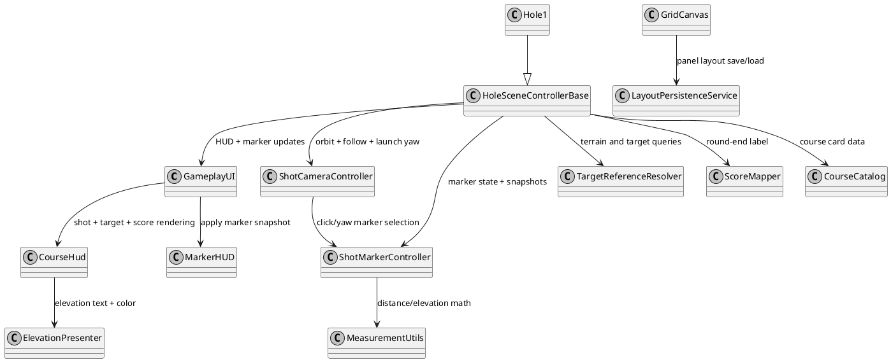

# OpenFairway Golf Physics

The worlds first open source golf physics library. Realistic golf ball physics engine for Godot 4. Provides force, torque, bounce, and surface interaction calculations usable from both C# and GDScript. 

- Latest release **v1.0.5** data compared to FS and GSP reference sources. See data results here: [Shot Data]
- Fast iteration tooling using godot console to calculate physics tuning against source of truth. 
- (https://github.com/digitalhand/openfairway/tree/main/assets/data/calibration/history) 

YouTube Video [Demo of OpenFairway v1.0.2](https://youtu.be/IYSF5w6ROzo) (updated video coming soon)

 

[](https://github.com/digitalhand/openfairway/actions/workflows/ci.yml)
[](LICENSE)
[](https://dotnet.microsoft.com/)
[](https://godotengine.org/)

## Table of Contents

- [Features](#features)
- [Requirements](#requirements)
- [Installation](#installation)
- [Quick Start](#quick-start)
- [Camera Updates (Hole Scene)](#camera-updates-hole-scene)
- [Range Mode (Driving Range)](#range-mode-driving-range)
- [Marker Controls](#marker-controls)
- [Keyboard Shortcuts](#keyboard-shortcuts)
- [Hole HUD Reusable Components](#hole-hud-reusable-components)
- [Panel Visibility Settings](#panel-visibility-settings)
- [Test Shots Setting](#test-shots-setting)
- [Launch Monitor Connection Indicator](#launch-monitor-connection-indicator)
- [Surface Zones (Local Terrain Overrides)](#surface-zones-local-terrain-overrides)
- [Distance Benchmarks](#distance-benchmarks)
- [Calibration Workflow](#calibration-workflow)
- [Known Feature Gaps](#known-feature-gaps)
- [Addon Classes](#addon-classes)
- [Addon Structure](#addon-structure)
- [Documentation](#documentation)
- [Units Convention](#units-convention)
- [License](#license)

## Features

- Aerodynamic drag and Magnus lift from wind-tunnel polynomial fits
- Bounce model with spin-dependent COR and tangential retention (Penner)
- Surface presets for fairway, rough, soft, and firm conditions
- Area-based surface zone overrides (`SurfaceZone`) for local terrain patches
- Spin-based ground friction with "check up" behavior for high-spin shots
- Launch monitor spin parsing (BackSpin/SideSpin or TotalSpin/SpinAxis)
- Headless shot simulation via `PhysicsAdapter` — no scene tree required

## Requirements

- **Godot 4.5+** with **.NET support**
- **.NET 9.0 SDK** (or later)

GDScript projects can use this addon — Godot's cross-language scripting handles the interop automatically, but the .NET editor build is required.

## Installation

1. Copy `addons/openfairway/` into your project's `addons/` directory.
2. **Ensure your project has a C# solution.** If you don't have a `.csproj`/`.sln` yet, generate them via **Project > Tools > C# > Create C# Solution** in the Godot editor. Alternatively, create any temporary C# script (Node > Attach Script > Language: C#) and Godot will generate both files automatically.
3. Build your project: **Build > Build Project** in the editor (`Alt+B`), or `dotnet build YourProject.csproj` from the command line.
4. Enable the plugin: **Project > Project Settings > Plugins > OpenFairway Physics**.

## Quick Start

### C#

```csharp
var bp = new BallPhysics();
var aero = new Aerodynamics();

var p = new PhysicsParams(
    airDensity: aero.GetAirDensity(0f, 75f, PhysicsEnums.Units.Imperial),
    airViscosity: aero.GetDynamicViscosity(75f, PhysicsEnums.Units.Imperial),
    dragScale: 1f, liftScale: 1f,
    kineticFriction: 0.30f, rollingFriction: 0.030f,
    grassViscosity: 0.001f, criticalAngle: 0.25f,
    floorNormal: Vector3.Up);

Vector3 force = bp.CalculateForces(velocity, omega, onGround, p);
Vector3 torque = bp.CalculateTorques(velocity, omega, onGround, p);
```

### GDScript

```gdscript
var physics = BallPhysics.new()
var aero = Aerodynamics.new()

var params = PhysicsParams.new()
params.air_density = aero.get_air_density(0.0, 75.0, PhysicsEnums.Units.Imperial)
params.air_viscosity = aero.get_dynamic_viscosity(75.0, PhysicsEnums.Units.Imperial)
params.drag_scale = 1.0
params.lift_scale = 1.0
params.floor_normal = Vector3.UP

var force = physics.calculate_forces(velocity, omega, false, params)
```

### Headless Simulation

Run a full shot with no scene tree:

```csharp
var adapter = new PhysicsAdapter();
var result = adapter.SimulateShotFromJson(new Godot.Collections.Dictionary
{
    ["BallData"] = new Godot.Collections.Dictionary
    {
        ["Speed"] = 150.0,       // mph
        ["VLA"] = 12.5,          // degrees
        ["HLA"] = 0.0,           // degrees
        ["TotalSpin"] = 2800,    // RPM
        ["SpinAxis"] = 0.0       // degrees
    }
});
// result["carry_yd"], result["total_yd"]
```

## Camera Updates (Hole Scene)

The primary gameplay scene (`res://courses/airways_fresno/hole_1/hole_1.tscn`) uses `ShotCameraController` for an orbit + follow workflow:

- At rest, use `ui_left` / `ui_right` (left/right arrows by default) to orbit the camera around the ball.
- A temporary ground aim marker appears while orbiting to show the current launch direction.
- Shot launch direction is derived from camera aim and applied as world yaw to the ball launch vector.
- On shot start, camera follow snaps immediately to the follow offset before enabling follow mode to avoid drift/swing.
- On ball rest, camera follow is frozen, then camera resets behind the current lie after the configured reset delay.

Keyboard controls are listed in [Keyboard Shortcuts](#keyboard-shortcuts).

## Range Mode (Driving Range)

The main menu `RANGE` tile now loads `res://courses/range.tscn` as a dedicated practice range scene.

- Reuses the same gameplay stack as hole scenes: ball physics, shot tracer, camera rig, data HUD, and settings HUD.
- Auto-reset is enforced for range shots after the ball comes to rest.
- Camera behavior matches hole flow: follow on launch/flight, then tween back after the configured reset timer.
- Range fairway coverage is extended to approximately `400 yds` downrange by `600 yds` wide.
- A black-and-white checker style is applied to the range fairway mesh for visibility.

## Marker Controls

Marker rendering is driven by `ShotMarkerController` and displayed by `ui/MarkerHUD.cs`.

- Left-click on terrain (not over UI) while the ball is at rest to place a player marker.
- A placed marker immediately reorients camera yaw to the selected point.
- Flag marker position comes from the active target reference (flag pole if present, otherwise fallback target nodes).
- Markers are suppressed during shot launch/flight and during goal countdown.
- Round reset clears player marker selection and repopulates the flag marker snapshot.

## Keyboard Shortcuts

- `F` toggles fullscreen/windowed mode.
- `P` toggles shot controls visibility.
- `H` (`hit`) injects a local test shot.
- `R` (`reset`) resets shot display/camera/ball state.
- `Tab` triggers the same round reset behavior as `R`.
- `ui_left` / `ui_right` (left/right arrows by default) orbit around the ball at rest.

## Hole HUD Reusable Components

Current hole-scene HUD logic is composed from reusable components:

- `utils/MeasurementUtils.cs`
  - Centralized distance/elevation conversions (`meters -> yards`, `meters -> feet`).
  - Used by both target HUD and world marker calculations.
- `ui/ElevationPresenter.cs`
  - Centralized elevation presentation (arrow direction, signed text, and color selection).
  - Keeps target elevation and marker elevation visually consistent.
- `ui/LayoutPersistenceService.cs`
  - Centralized panel layout save/load/apply behavior.
  - Persists panel position and visibility in `user://layout.cfg` for reusable layout management.

Hole scene integration points:

- `game/hole/HoleSceneControllerBase.cs`
  - Reusable hole gameplay orchestration (shot launch, target refresh, marker snapshots, score/stroke updates, reset flow, and goal completion flow wiring).
- `courses/airways_fresno/hole_1/Hole1.cs`
  - Thin hole-specific scene controller that inherits `HoleSceneControllerBase`.
- `game/camera/ShotCameraController.cs`
  - Handles orbit/follow behavior and click-to-aim camera recentering.
- `game/markers/ShotMarkerController.cs`
  - Builds flag/player marker snapshots and publishes updates.
- `ui/GameplayUI.cs`, `ui/CourseHud.cs`, `ui/MarkerHUD.cs`
  - Render shot data, elevation visuals, score card state, and world markers.

The reusable scoring label mapper for per-course par logic remains in `game/scoring/ScoreMapper.cs` and course header metadata is defined in `game/scoring/CourseCatalog.cs`.

### Component Diagram



## Panel Visibility Settings

HUD data panels are managed through the Settings screen:

- Open `Settings` and select the `Panels` tab.
- Each panel is shown as a square card with a `Visible` checkbox.
- Toggling a checkbox immediately shows/hides that panel on the HUD.
- Visibility changes are saved to `user://layout.cfg` through the existing layout persistence flow.

Shortcut behavior:

- Right-click any visible HUD data panel to open `Settings` directly to the `Panels` tab.

## Test Shots Setting

Test-shot controls can be enabled or disabled from the Player settings tab:

- Open `Settings` and go to `Player`.
- Toggle `Enable Test Shots`.
- When disabled, test-shot UI is hidden (`Shot Type`, `Hit Shot`, and injector controls) and test-shot launch paths are ignored.
- This preference persists across restarts via `user://app_settings.cfg`.

## Launch Monitor Connection Indicator

TCP launch monitor listening now starts from app startup through the `TcpServerService` autoload.

- The main menu top banner (right side) shows launch monitor status only after a valid payload includes a top-level `DeviceID`.
- When identified, the indicator shows a green circle and the connected launch monitor name (for example, `PiTrac LM 0.1`).
- If the monitor disconnects, the status indicator is hidden again.
- Course scenes consume the same shared TCP service, so listener ownership is not duplicated across scene transitions.

## Surface Zones (Local Terrain Overrides)

Use `SurfaceZone` to apply local surface physics to patches like tall grass, cart paths, or special lies.

1. Add an `Area3D` where you want the surface override.
2. Add a `CollisionShape3D` under that `Area3D` to define the patch volume.
3. Attach `res://game/SurfaceZone.cs` to the `Area3D`.
4. In the Inspector, set `SurfaceType` (for tall grass use `Rough`).
5. Ensure collision layers/masks allow the ball (`ShotTracker/Ball`) to enter/exit the area.

Behavior details:

- Entering a zone applies that zone's `SurfaceType` immediately.
- Exiting restores the previous active zone surface (stacked overlap support).
- If no zone is active, the ball falls back to the active hole `SurfaceType` setting.

Current surface tuning intent:

- `Fairway` is slowed vs prior baseline to reduce excessive rollout.
- `Firm` is configured as a hard pavement/concrete style lie and matches the prior fast fairway baseline.
- `FairwaySoft` and `Rough` are progressively slower than `Fairway`.

## Distance Benchmarks

Run the headless benchmark suite and produce a carry/total/rollout table for the current benchmark shot set in [`run_benchmarks.gd`](/home/jesher/Code/Github/digitalhand/openfairway/run_benchmarks.gd):

```bash
godot --headless --script run_benchmarks.gd
```

For carry work, also run the Godot-backed LM carry-window suite:

```bash
dotnet test --filter "Category=LmCarryWindow"
```

Use the benchmark script for broad flight/rollout trend checking and the LM suite for carry-window regression. See [`tests/PhysicsTests/README.md`](/home/jesher/Code/Github/digitalhand/openfairway/tests/PhysicsTests/README.md) for the full workflow and expected diagnostics.

## Calibration Workflow

Use the calibration tooling under [`tools/shot_calibration/README.md`](/home/jesher/Code/Github/digitalhand/openfairway/tools/shot_calibration/README.md) for carry-focused analysis and iteration against source-of-truth data.

- Physics parameter tuning profile: `assets/data/calibration/calibration_profile.json`
- Calibration carry exception profile (diagnostic-only, explicit opt-in): `assets/data/calibration/carry_exception_profile.json`
- Critical carry report output: `assets/data/openfairway_critical_carry_<timestamp>.csv`

The carry exception layer is calibration analysis tooling and is disabled by default. It only applies when explicitly enabled via `--carry-exceptions`, and does not modify core runtime equations in `addons/openfairway/physics/`.

## Known Feature Gaps

- Main menu has a visual `RangeTile`, but only `CoursesTile` is currently actionable (`MainMenu.cs` wires only `CoursesButton`).
- `CourseCatalog` is hardcoded for a single hole/course card and does not yet support multi-course discovery or progression.
- Marker UX currently has no dedicated clear-marker input, no save/restore across scene transitions, and no marker-specific tests.
- Tracked backlog: `docs/feature-gaps.md`.

## Addon Classes

| Class | Base | Description |
|-------|------|-------------|
| `BallPhysics` | `RefCounted` | Force, torque, and bounce calculations |
| `PhysicsParams` | `Resource` | Exported physics parameters |
| `BounceResult` | `RefCounted` | Bounce calculation result |
| `Aerodynamics` | `RefCounted` | Drag/lift coefficients, air density, viscosity |
| `Surface` | `RefCounted` | Surface parameter presets |
| `ShotSetup` | `RefCounted` | Spin parsing and launch vector utilities |
| `PhysicsAdapter` | `RefCounted` | Headless shot simulator |

All C# classes use `[GlobalClass]` for GDScript visibility. Enums are provided via `physics_enums.gd` (GDScript mirror of the C# `PhysicsEnums` definitions).

## Addon Structure

```
addons/openfairway/
├── plugin.cfg            Godot plugin metadata
├── plugin.gd             Plugin entry point
├── physics_enums.gd      GDScript enum mirror (BallState, Units, SurfaceType)
├── LICENSE               MIT license
├── README.md             Full GDScript API reference and examples
└── physics/
    ├── BallPhysics.cs    Force/torque/bounce calculations
    ├── PhysicsParams.cs  Physics parameters (Resource, exported)
    ├── BounceResult.cs   Bounce result data
    ├── Aerodynamics.cs   Cd/Cl coefficients, air properties
    ├── Surface.cs        Surface parameter presets
    ├── ShotSetup.cs      Spin parsing & launch vector utilities
    ├── FlightAerodynamicsModel.cs Shared flight coefficient model and diagnostics sample
    ├── PhysicsAdapter.cs Headless shot simulator
    ├── PhysicsEnums.cs   C# enum definitions (static class)
    └── README.md         Physics formulas and tuning guide
```

## Documentation

- **[Addon README](addons/openfairway/README.md)** — installation, API usage, runtime architecture, surface integration, formulas, tuning guide, and rendered physics diagrams
- **[Physics Tests README](tests/PhysicsTests/README.md)** — benchmark workflow, carry-window regression, and CI-safe formula coverage

## Units Convention

The physics engine always uses SI internally (meters, m/s, rad/s). Launch monitor input uses Imperial (mph, degrees, RPM). Display conversion is the consumer's responsibility. See `ShotSetup.BuildLaunchVectors()` for the standard conversion path.

## License

MIT — see [LICENSE](addons/openfairway/LICENSE).
